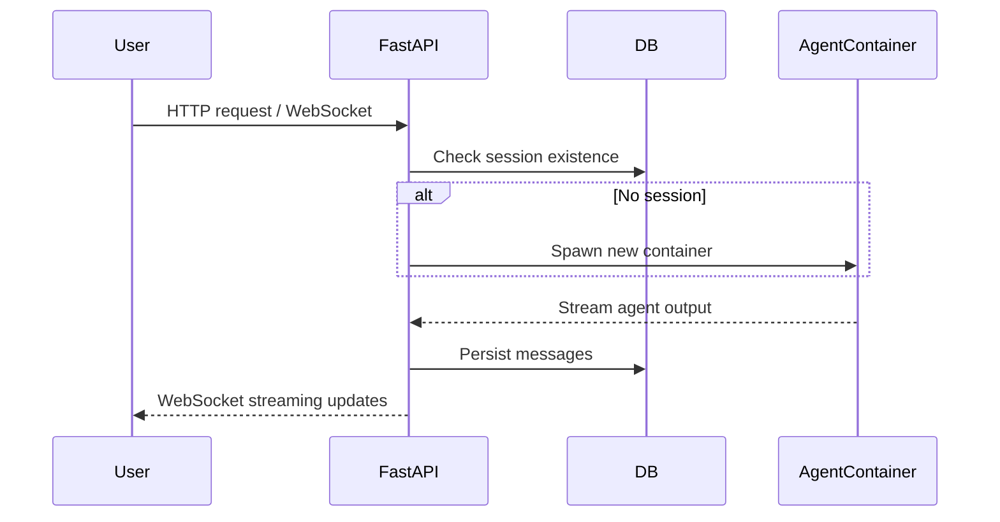

# Zeng Yu

## Project: Computer Use Product

---

## 1. Project Structure

```text
computer-use-product/
│
├── agent/                         # Core AI agent logic
│   ├── __init__.py
│   ├── agent_manager.py           # Spawns/monitors AI agent environments
│   ├── session.py                 # Session state & history management
│   └── utils.py
│
├── api/                           # FastAPI backend
│   ├── __init__.py
│   ├── main.py                    # FastAPI entry point
│   ├── routes/
│   │   ├── sessions.py
│   │   ├── messages.py
│   │   └── health.py
│   └── websocket.py
│
├── db/                            # Database layer
│   ├── models.py
│   ├── schemas.py
│   └── crud.py
│
├── docker/                        # Docker setup
│   ├── Dockerfile.agent
│   ├── Dockerfile.api
│   ├── docker-compose.yml
│   └── .env
│
├── tests/
│   ├── test_api.py
│   └── test_agent.py
│
├── docs/
│   ├── readme.md
│   └── plan.md
│
└── requirements.txt
````

**Reasoning:**

* `agent/` → AI agent logic (containerized)
* `api/` → FastAPI endpoints & WebSocket streaming
* `db/` → Database models & CRUD
* `docker/` → Dockerfiles + docker-compose
* `tests/` → Unit & integration tests

---

## 2. Sequence Diagram (User Request Lifecycle)



---

## 3. API Endpoints

| Method | Path                   | Description                          |
| ------ | ---------------------- | ------------------------------------ |
| POST   | /sessions/start        | Create new session                   |
| GET    | /sessions/{id}         | Get session info                     |
| POST   | /messages/send         | Send user message to agent           |
| GET    | /messages/{session_id} | Fetch message history                |
| WS     | /ws/{session_id}       | WebSocket streaming for real-time AI |
| GET    | /health                | Service health check                 |

---

## 4. Database Schema

```sql
-- sessions table
CREATE TABLE sessions (
    session_id UUID PRIMARY KEY,
    user_id UUID,
    status VARCHAR(20),
    created_at TIMESTAMP,
    updated_at TIMESTAMP
);

-- messages table
CREATE TABLE messages (
    message_id UUID PRIMARY KEY,
    session_id UUID REFERENCES sessions(session_id),
    sender VARCHAR(20),  -- user / agent
    content TEXT,
    timestamp TIMESTAMP
);

-- agent_state table
CREATE TABLE agent_state (
    session_id UUID REFERENCES sessions(session_id),
    container_id VARCHAR(50),
    last_action JSONB,
    status VARCHAR(20)
);
```

---

5. Concurrency Design

Key requirement: No fixed concurrent sessions. No sequential queuing.

Strategy:

Dynamic Agent Pooling:

Use agent_manager.py to spawn a new container for every new session.

Use Docker SDK / Kubernetes Pod API to dynamically create/remove containers.

Async Communication:

FastAPI endpoints use async def to avoid blocking.

WebSocket connections stream output from agent containers asynchronously.

State Management:

Each session tied to a container ID.

DB ensures persistence of session & messages.

Locks/mutex unnecessary at container level, because each session isolated.

Scaling Strategy:

Local: Docker spawn per session.

Cloud: Kubernetes Horizontal Pod Autoscaler (HPA) to scale agent pods automatically.

Avoid race conditions:

Isolation: one container per session.

DB writes are atomic per message (INSERT with timestamps).

WebSocket channels tied to session ID.

6. API Endpoints (FastAPI)
Method	Path	Description
POST	/sessions/start	Create new session
GET	/sessions/{id}	Get session info
POST	/messages/send	Send user message to agent
GET	/messages/{session_id}	Fetch message history
WS	/ws/{session_id}	WebSocket streaming for real-time AI
GET	/health	Service health check
7. Docker Setup

Dockerfile.agent: Container with AI agent + dependencies.

Dockerfile.api: FastAPI service with WebSocket + DB connection.

docker-compose.yml:

version: '3.9'
services:
  api:
    build:
      context: ./docker
      dockerfile: Dockerfile.api
    ports:
      - "8000:8000"
    environment:
      - DATABASE_URL=postgres://user:pass@db:5432/computer_use
    depends_on:
      - db
  agent:
    build:
      context: ./docker
      dockerfile: Dockerfile.agent
  db:
    image: postgres:15
    environment:
      POSTGRES_USER: user
      POSTGRES_PASSWORD: pass
      POSTGRES_DB: computer_use
    ports:
      - "5432:5432"
8. README.md Plan

Include:

Full name (on first line)

Project structure explanation

Sequence diagram (ASCII or Mermaid)

API endpoints documentation

DB schema

Concurrency design explanation

9. plan.md Implementation Plan

Step-by-step:

Fork/clone Anthropic demo → setup Docker locally.

Replace Streamlit with FastAPI.

Implement DB models & migration scripts.

Implement agent_manager.py → dynamic container spawning per session.

Implement WebSocket endpoint /ws/{session_id} → stream AI responses.

Implement session & message CRUD.

Setup docker-compose with API + DB + Agent base images.

Test local concurrency with multiple WebSocket clients.

Push initial skeleton to private GitHub repo (Dockerfiles + empty directories).# python
